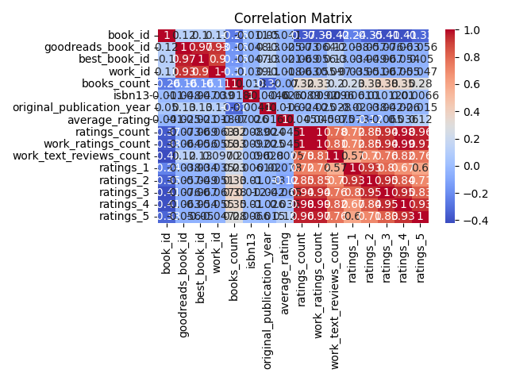

# Automated Analysis Report for goodreads.csv

## Dataset Overview
Columns and Types:

book_id                      float64
goodreads_book_id            float64
best_book_id                 float64
work_id                      float64
books_count                  float64
isbn                          object
isbn13                       float64
authors                       object
original_publication_year    float64
original_title                object
title                         object
language_code                 object
average_rating               float64
ratings_count                float64
work_ratings_count           float64
work_text_reviews_count      float64
ratings_1                    float64
ratings_2                    float64
ratings_3                    float64
ratings_4                    float64
ratings_5                    float64
image_url                     object
small_image_url               object

### Summary Statistics
```
            book_id  goodreads_book_id  best_book_id       work_id   books_count       isbn        isbn13       authors  original_publication_year original_title           title language_code  average_rating  ratings_count  work_ratings_count  work_text_reviews_count      ratings_1      ratings_2      ratings_3     ratings_4     ratings_5                                                                                 image_url                                                                         small_image_url
count   10000.00000       1.000000e+04  1.000000e+04  1.000000e+04  10000.000000       9300  1.000000e+04         10000               10000.000000           9415           10000          8916    10000.000000   1.000000e+04        1.000000e+04             10000.000000   10000.000000   10000.000000   10000.000000  1.000000e+04  1.000000e+04                                                                                     10000                                                                                   10000
unique          NaN                NaN           NaN           NaN           NaN       9300           NaN          4664                        NaN           9274            9964            25             NaN            NaN                 NaN                      NaN            NaN            NaN            NaN           NaN           NaN                                                                                      6669                                                                                    6669
top             NaN                NaN           NaN           NaN           NaN  375700455           NaN  Stephen King                        NaN                 Selected Poems           eng             NaN            NaN                 NaN                      NaN            NaN            NaN            NaN           NaN           NaN  https://s.gr-assets.com/assets/nophoto/book/111x148-bcc042a9c91a29c1d680899eff700a03.png  https://s.gr-assets.com/assets/nophoto/book/50x75-a91bf249278a81aabab721ef782c4a74.png
freq            NaN                NaN           NaN           NaN           NaN          1           NaN            60                        NaN              5               4          6341             NaN            NaN                 NaN                      NaN            NaN            NaN            NaN           NaN           NaN                                                                                      3332                                                                                    3332
mean     5000.50000       5.264697e+06  5.471214e+06  8.646183e+06     75.712700        NaN  9.755044e+12           NaN                1981.987674            NaN             NaN           NaN        4.002191   5.400124e+04        5.968732e+04              2919.955300    1345.040600    3110.885000   11475.893800  1.996570e+04  2.378981e+04                                                                                       NaN                                                                                     NaN
std      2886.89568       7.575462e+06  7.827330e+06  1.175106e+07    170.470728        NaN  4.297117e+11           NaN                 152.416359            NaN             NaN           NaN        0.254427   1.573700e+05        1.678038e+05              6124.378132    6635.626263    9717.123578   28546.449183  5.144736e+04  7.976889e+04                                                                                       NaN                                                                                     NaN
min         1.00000       1.000000e+00  1.000000e+00  8.700000e+01      1.000000        NaN  1.951703e+08           NaN               -1750.000000            NaN             NaN           NaN        2.470000   2.716000e+03        5.510000e+03                 3.000000      11.000000      30.000000     323.000000  7.500000e+02  7.540000e+02                                                                                       NaN                                                                                     NaN
25%      2500.75000       4.627575e+04  4.791175e+04  1.008841e+06     23.000000        NaN  9.780312e+12           NaN                1990.000000            NaN             NaN           NaN        3.850000   1.356875e+04        1.543875e+04               694.000000     196.000000     656.000000    3112.000000  5.405750e+03  5.334000e+03                                                                                       NaN                                                                                     NaN
50%      5000.50000       3.949655e+05  4.251235e+05  2.719524e+06     40.000000        NaN  9.780447e+12           NaN                2004.000000            NaN             NaN           NaN        4.020000   2.115550e+04        2.383250e+04              1402.000000     391.000000    1163.000000    4894.000000  8.269500e+03  8.836000e+03                                                                                       NaN                                                                                     NaN
75%      7500.25000       9.382225e+06  9.636112e+06  1.451775e+07     67.000000        NaN  9.780808e+12           NaN                2011.000000            NaN             NaN           NaN        4.180000   4.105350e+04        4.591500e+04              2744.250000     885.000000    2353.250000    9287.000000  1.602350e+04  1.730450e+04                                                                                       NaN                                                                                     NaN
max     10000.00000       3.328864e+07  3.553423e+07  5.639960e+07   3455.000000        NaN  9.790008e+12           NaN                2017.000000            NaN             NaN           NaN        4.820000   4.780653e+06        4.942365e+06            155254.000000  456191.000000  436802.000000  793319.000000  1.481305e+06  3.011543e+06                                                                                       NaN                                                                                     NaN
```

### Missing Values
```
book_id                         0
goodreads_book_id               0
best_book_id                    0
work_id                         0
books_count                     0
isbn                          700
isbn13                          0
authors                         0
original_publication_year       0
original_title                585
title                           0
language_code                1084
average_rating                  0
ratings_count                   0
work_ratings_count              0
work_text_reviews_count         0
ratings_1                       0
ratings_2                       0
ratings_3                       0
ratings_4                       0
ratings_5                       0
image_url                       0
small_image_url                 0
```

## Visualizations

### Correlation Matrix Insights:
{'id': 'chatcmpl-AdeOJwPpxYEOPy7ROwYFoSlvC3RMm', 'object': 'chat.completion', 'created': 1734013419, 'model': 'gpt-4o-mini-2024-07-18', 'choices': [{'index': 0, 'message': {'role': 'assistant', 'content': "I'm unable to directly view files or images on your computer. However, I can guide you on how to analyze a correlation matrix visualization if you describe it to me.\n\nHere are some steps and insights you can consider when analyzing a correlation matrix:\n\n1. **Understanding Correlation**: Correlation values range from -1 to 1. A value close to 1 indicates a strong positive correlation, meaning that as one variable increases, the other also tends to increase. A value close to -1 indicates a strong negative correlation, meaning that as one variable increases, the other tends to decrease. A value around 0 suggests no correlation.\n\n2. **Identifying Strong Correlations**: Look for pairs of variables with correlation coefficients close to 1 or -1. These relationships may be significant in your analysis and could imply a potential cause-and-effect relationship or a strong association.\n\n3. **Analyzing Weak Correlations**: Variables with correlation coefficients around 0 might indicate that they do not have a linear relationship. This could suggest that they are independent or that their relationship is non-linear.\n\n4. **Variable Relationships**: Consider the context of the variables. For example, in a dataset related to books (like Goodreads), you might have variables like ratings, number of reviews, genre, or author popularity. Understanding these relationships can help in drawing meaningful conclusions.\n\n5. **Outliers**: Check for any outliers in the data that might skew the correlation results. Outliers can significantly affect the correlation coefficients and should be investigated.\n\n6. **Implications of Findings**: Based on the correlations identified, think about what these relationships might mean for your project. For instance, if there's a strong correlation between ratings and the number of reviews, it might suggest that more popular books tend to get higher ratings.\n\nIf you can describe the specific variables and the correlation values presented in your matrix, I'd be happy to help you interpret them further!", 'refusal': None}, 'logprobs': None, 'finish_reason': 'stop'}], 'usage': {'prompt_tokens': 44, 'completion_tokens': 388, 'total_tokens': 432, 'prompt_tokens_details': {'cached_tokens': 0, 'audio_tokens': 0}, 'completion_tokens_details': {'reasoning_tokens': 0, 'audio_tokens': 0, 'accepted_prediction_tokens': 0, 'rejected_prediction_tokens': 0}}, 'system_fingerprint': 'fp_bba3c8e70b', 'monthlyCost': 0.12402900000000001, 'cost': 0.0024600000000000004, 'monthlyRequests': 21}

