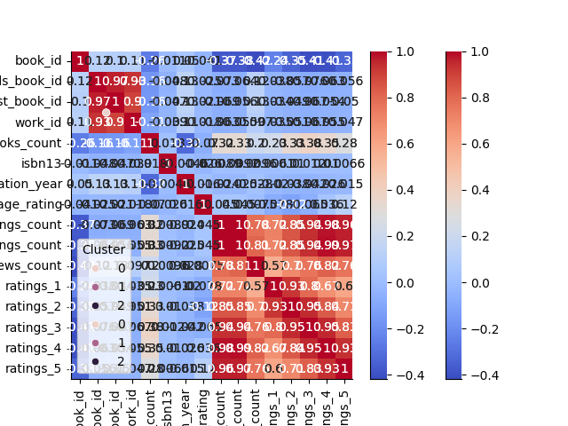

# Automated Analysis Report for goodreads.csv
## Dataset Overview
Columns and Types:
book_id                      float64
goodreads_book_id            float64
best_book_id                 float64
work_id                      float64
books_count                  float64
isbn                          object
isbn13                       float64
authors                       object
original_publication_year    float64
original_title                object
title                         object
language_code                 object
average_rating               float64
ratings_count                float64
work_ratings_count           float64
work_text_reviews_count      float64
ratings_1                    float64
ratings_2                    float64
ratings_3                    float64
ratings_4                    float64
ratings_5                    float64
image_url                     object
small_image_url               object
Cluster                        int32
dtype: object

Summary Statistics:
            book_id  goodreads_book_id  best_book_id       work_id   books_count       isbn        isbn13       authors  original_publication_year original_title           title language_code  average_rating  ratings_count  work_ratings_count  work_text_reviews_count      ratings_1      ratings_2      ratings_3     ratings_4     ratings_5                                                                                 image_url                                                                         small_image_url
count   10000.00000       1.000000e+04  1.000000e+04  1.000000e+04  10000.000000       9300  1.000000e+04         10000               10000.000000           9415           10000          8916    10000.000000   1.000000e+04        1.000000e+04             10000.000000   10000.000000   10000.000000   10000.000000  1.000000e+04  1.000000e+04                                                                                     10000                                                                                   10000
unique          NaN                NaN           NaN           NaN           NaN       9300           NaN          4664                        NaN           9274            9964            25             NaN            NaN                 NaN                      NaN            NaN            NaN            NaN           NaN           NaN                                                                                      6669                                                                                    6669
top             NaN                NaN           NaN           NaN           NaN  375700455           NaN  Stephen King                        NaN                 Selected Poems           eng             NaN            NaN                 NaN                      NaN            NaN            NaN            NaN           NaN           NaN  https://s.gr-assets.com/assets/nophoto/book/111x148-bcc042a9c91a29c1d680899eff700a03.png  https://s.gr-assets.com/assets/nophoto/book/50x75-a91bf249278a81aabab721ef782c4a74.png
freq            NaN                NaN           NaN           NaN           NaN          1           NaN            60                        NaN              5               4          6341             NaN            NaN                 NaN                      NaN            NaN            NaN            NaN           NaN           NaN                                                                                      3332                                                                                    3332
mean     5000.50000       5.264697e+06  5.471214e+06  8.646183e+06     75.712700        NaN  9.755044e+12           NaN                1981.987674            NaN             NaN           NaN        4.002191   5.400124e+04        5.968732e+04              2919.955300    1345.040600    3110.885000   11475.893800  1.996570e+04  2.378981e+04                                                                                       NaN                                                                                     NaN
std      2886.89568       7.575462e+06  7.827330e+06  1.175106e+07    170.470728        NaN  4.297117e+11           NaN                 152.416359            NaN             NaN           NaN        0.254427   1.573700e+05        1.678038e+05              6124.378132    6635.626263    9717.123578   28546.449183  5.144736e+04  7.976889e+04                                                                                       NaN                                                                                     NaN
min         1.00000       1.000000e+00  1.000000e+00  8.700000e+01      1.000000        NaN  1.951703e+08           NaN               -1750.000000            NaN             NaN           NaN        2.470000   2.716000e+03        5.510000e+03                 3.000000      11.000000      30.000000     323.000000  7.500000e+02  7.540000e+02                                                                                       NaN                                                                                     NaN
25%      2500.75000       4.627575e+04  4.791175e+04  1.008841e+06     23.000000        NaN  9.780312e+12           NaN                1990.000000            NaN             NaN           NaN        3.850000   1.356875e+04        1.543875e+04               694.000000     196.000000     656.000000    3112.000000  5.405750e+03  5.334000e+03                                                                                       NaN                                                                                     NaN
50%      5000.50000       3.949655e+05  4.251235e+05  2.719524e+06     40.000000        NaN  9.780447e+12           NaN                2004.000000            NaN             NaN           NaN        4.020000   2.115550e+04        2.383250e+04              1402.000000     391.000000    1163.000000    4894.000000  8.269500e+03  8.836000e+03                                                                                       NaN                                                                                     NaN
75%      7500.25000       9.382225e+06  9.636112e+06  1.451775e+07     67.000000        NaN  9.780808e+12           NaN                2011.000000            NaN             NaN           NaN        4.180000   4.105350e+04        4.591500e+04              2744.250000     885.000000    2353.250000    9287.000000  1.602350e+04  1.730450e+04                                                                                       NaN                                                                                     NaN
max     10000.00000       3.328864e+07  3.553423e+07  5.639960e+07   3455.000000        NaN  9.790008e+12           NaN                2017.000000            NaN             NaN           NaN        4.820000   4.780653e+06        4.942365e+06            155254.000000  456191.000000  436802.000000  793319.000000  1.481305e+06  3.011543e+06                                                                                       NaN                                                                                     NaN

Missing Values:
book_id                         0
goodreads_book_id               0
best_book_id                    0
work_id                         0
books_count                     0
isbn                          700
isbn13                          0
authors                         0
original_publication_year       0
original_title                585
title                           0
language_code                1084
average_rating                  0
ratings_count                   0
work_ratings_count              0
work_text_reviews_count         0
ratings_1                       0
ratings_2                       0
ratings_3                       0
ratings_4                       0
ratings_5                       0
image_url                       0
small_image_url                 0

Outliers (Isolation Forest):
Detected 681 outliers

Clustering Results:
Cluster
0    9967
1      24
2       9

Regression Analysis Coefficients:
[-1.5477083681570378e-08, -1.047239951140673e-10, -6.721691875244033e-11, 1.7441226453277253e-11, -3.236691947162369e-07, -1.765944272247413e-13, -2.440423773252215e-07, 2.3227388304794376e-11, -7.291715668760783e-10, -1.5604105393210157e-09, 4.179894899528803e-08, -1.2324585948660527e-08, 2.5065078766310968e-09, 1.7330389595964234e-08, -1.498283360974379e-08, 5.910111546523025e-09]

LLM Insights:
{'id': 'chatcmpl-AddmDgJk1n6GJjkIDRgOYGpP234Lj', 'object': 'chat.completion', 'created': 1734011057, 'model': 'gpt-4o-mini-2024-07-18', 'choices': [{'index': 0, 'message': {'role': 'assistant', 'content': '```json\n{\n  "visualization_suggestions": [\n    {\n      "type": "bar_chart",\n      "x_axis": "authors",\n      "y_axis": "average_rating",\n      "description": "Average rating per author to identify which authors have the highest-rated books."\n    },\n    {\n      "type": "histogram",\n      "x_axis": "original_publication_year",\n      "description": "Distribution of books published over the years to observe trends in publishing."\n    },\n    {\n      "type": "scatter_plot",\n      "x_axis": "ratings_count",\n      "y_axis": "average_rating",\n      "description": "Relationship between the number of ratings and the average rating to see if popularity influences ratings."\n    },\n    {\n      "type": "pie_chart",\n      "labels": "language_code",\n      "values": "books_count",\n      "description": "Proportion of books available in different languages."\n    },\n    {\n      "type": "box_plot",\n      "x_axis": "Cluster",\n      "y_axis": "average_rating",\n      "description": "Comparison of average ratings across different clusters to analyze performance."\n    },\n    {\n      "type": "line_chart",\n      "x_axis": "original_publication_year",\n      "y_axis": "work_ratings_count",\n      "description": "Trend of ratings over time to see if newer books are receiving more ratings."\n    }\n  ],\n  "additional_insights": [\n    {\n      "insight": "Identify top-rated books",\n      "description": "List books with average ratings above a certain threshold (e.g., 4.5) to highlight highly-rated titles."\n    },\n    {\n      "insight": "Correlation analysis",\n      "description": "Evaluate correlations between different rating categories (ratings_1 to ratings_5) to understand reader preferences."\n    },\n    {\n      "insight": "Cluster analysis",\n      "description": "Explore different clusters to determine characteristics of books that fall into each category, such as genre or author popularity."\n    },\n    {\n      "insight": "Impact of publication year on ratings",\n      "description": "Analyze how the average ratings vary based on the year of publication to determine if older books are generally rated higher."\n    },\n    {\n      "insight": "Genre trends over time",\n      "description": "If genre information is available, analyze trends in ratings per genre over the years to see which genres are gaining popularity."\n    }\n  ]\n}\n```', 'refusal': None}, 'logprobs': None, 'finish_reason': 'stop'}], 'usage': {'prompt_tokens': 149, 'completion_tokens': 515, 'total_tokens': 664, 'prompt_tokens_details': {'cached_tokens': 0, 'audio_tokens': 0}, 'completion_tokens_details': {'reasoning_tokens': 0, 'audio_tokens': 0, 'accepted_prediction_tokens': 0, 'rejected_prediction_tokens': 0}}, 'system_fingerprint': 'fp_6fc10e10eb', 'monthlyCost': 0.07604100000000001, 'cost': 0.0035369999999999998, 'monthlyRequests': 14}

Regression Insights:
{'id': 'chatcmpl-AddmLMubcZaXo9qkwLZJ5yqRgdtLS', 'object': 'chat.completion', 'created': 1734011065, 'model': 'gpt-4o-mini-2024-07-18', 'choices': [{'index': 0, 'message': {'role': 'assistant', 'content': "To provide insights and actionable recommendations based on the given regression coefficients, we need to interpret these coefficients in the context of the variables they correspond to. However, without specific information about the variables, data context, and target outcome, I can provide general insights and recommendations based on common interpretations of regression coefficients.\n\n### Insights from Regression Coefficients\n\n1. **Magnitude and Sign**:\n   - The coefficients vary significantly in magnitude, indicating that some variables have a stronger influence on the dependent variable than others.\n   - Positive coefficients (e.g., 4.179894899528803e-08, 2.3227388304794376e-11) suggest a positive relationship with the target variable, meaning that as the predictor variable increases, the target variable tends to increase.\n   - Negative coefficients (e.g., -1.5477083681570378e-08, -3.236691947162369e-07) indicate an inverse relationship, where increasing the predictor leads to a decrease in the target variable.\n\n2. **Potentially Important Variables**:\n   - The variables associated with the largest absolute coefficients (both positive and negative) should be prioritized for further analysis and potential interventions. For example, the negative coefficient of -3.236691947162369e-07 suggests this variable may be critical in reducing the target outcome.\n\n3. **Insignificant Variables**:\n   - Very small coefficients (e.g., -1.047239951140673e-10, -1.765944272247413e-13) may indicate that those predictors do not significantly contribute to the model and could potentially be removed to simplify the model.\n\n### Actionable Recommendations\n\n1. **Focus on Key Predictors**:\n   - Identify the variables with the largest coefficients (both positive and negative) and consider focusing efforts on these areas. If these variables are modifiable (e.g., through policy changes, operational adjustments, or marketing strategies), targeted interventions could lead to significant improvements in the target outcome.\n\n2. **Data Exploration**:\n   - Conduct further exploration of the relationships between the predictors and the target variable. Utilize visualizations such as scatter plots or correlation matrices to assess the strength and nature of these relationships.\n\n3. **Model Evaluation**:\n   - If not already done, evaluate the overall model fit and performance metrics (such as R-squared, MSE, etc.) to determine how well the regression model captures the data. This can help in understanding the reliability of the coefficients.\n\n4. **Variable Transformation**:\n   - Consider transforming variables that may improve the model's performance. For example, if a relationship appears non-linear, polynomial or logarithmic transformations of predictors might be beneficial.\n\n5. **Further Testing**:\n   - Conduct hypothesis testing (e.g., t-tests for coefficients) to determine if the coefficients are statistically significant. This can help in confirming which predictors are worth acting upon.\n\n6. **Monitor and Adjust**:\n   - After implementing changes based on the insights gathered, monitor the results and adjust strategies as necessary. Continuous feedback and iteration will help in achieving better outcomes.\n\nBy implementing these recommendations, you can leverage the insights from the regression coefficients to make data-driven decisions and enhance the performance of your relevant business area or research focus.", 'refusal': None}, 'logprobs': None, 'finish_reason': 'stop'}], 'usage': {'prompt_tokens': 228, 'completion_tokens': 661, 'total_tokens': 889, 'prompt_tokens_details': {'cached_tokens': 0, 'audio_tokens': 0}, 'completion_tokens_details': {'reasoning_tokens': 0, 'audio_tokens': 0, 'accepted_prediction_tokens': 0, 'rejected_prediction_tokens': 0}}, 'system_fingerprint': 'fp_818c284075', 'monthlyCost': 0.08069100000000001, 'cost': 0.00465, 'monthlyRequests': 15}

## Visualizations


