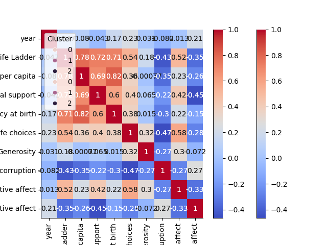

# Automated Analysis Report for happiness.csv
## Dataset Overview
Columns and Types:
Country name                         object
year                                float64
Life Ladder                         float64
Log GDP per capita                  float64
Social support                      float64
Healthy life expectancy at birth    float64
Freedom to make life choices        float64
Generosity                          float64
Perceptions of corruption           float64
Positive affect                     float64
Negative affect                     float64
Cluster                               int32
dtype: object

Summary Statistics:
       Country name         year  Life Ladder  Log GDP per capita  Social support  Healthy life expectancy at birth  Freedom to make life choices   Generosity  Perceptions of corruption  Positive affect  Negative affect
count          2363  2363.000000  2363.000000         2363.000000     2363.000000                       2363.000000                   2363.000000  2363.000000                2363.000000      2363.000000      2363.000000
unique          165          NaN          NaN                 NaN             NaN                               NaN                           NaN          NaN                        NaN              NaN              NaN
top       Argentina          NaN          NaN                 NaN             NaN                               NaN                           NaN          NaN                        NaN              NaN              NaN
freq             18          NaN          NaN                 NaN             NaN                               NaN                           NaN          NaN                        NaN              NaN              NaN
mean            NaN  2014.763860     5.483566            9.399671        0.809369                         63.401828                      0.750282     0.000098                   0.743971         0.651882         0.273151
std             NaN     5.059436     1.125522            1.145221        0.120878                          6.750773                      0.138291     0.158596                   0.179907         0.105699         0.086835
min             NaN  2005.000000     1.281000            5.527000        0.228000                          6.720000                      0.228000    -0.340000                   0.035000         0.179000         0.083000
25%             NaN  2011.000000     4.647000            8.520000        0.744000                         59.545000                      0.662000    -0.108000                   0.696000         0.573000         0.209000
50%             NaN  2015.000000     5.449000            9.492000        0.834000                         64.900000                      0.769000    -0.015000                   0.790000         0.662000         0.263000
75%             NaN  2019.000000     6.323500           10.382000        0.904000                         68.400000                      0.861000     0.088000                   0.864000         0.736500         0.326000
max             NaN  2023.000000     8.019000           11.676000        0.987000                         74.600000                      0.985000     0.700000                   0.983000         0.884000         0.705000

Missing Values:
Country name                        0
year                                0
Life Ladder                         0
Log GDP per capita                  0
Social support                      0
Healthy life expectancy at birth    0
Freedom to make life choices        0
Generosity                          0
Perceptions of corruption           0
Positive affect                     0
Negative affect                     0

Outliers (Isolation Forest):
Detected 262 outliers

Clustering Results:
Cluster
0    908
2    853
1    602

Regression Analysis Coefficients:
[-0.131660829146177, -0.003621302216010548, -0.01587322353263657, -0.38219748067406095, 0.013263215371387221, -0.5113742609973725, 0.13115726797729343, -0.01179510302471136, 0.49815086364796357, 0.7645696121847856]

LLM Insights:
{'id': 'chatcmpl-AdZ91qEinRJ1d6aJNxR36B6LZnrRT', 'object': 'chat.completion', 'created': 1733993251, 'model': 'gpt-4o-mini-2024-07-18', 'choices': [{'index': 0, 'message': {'role': 'assistant', 'content': '```json\n{\n  "visualizations": [\n    {\n      "type": "scatter_plot",\n      "x_axis": "Log GDP per capita",\n      "y_axis": "Life Ladder",\n      "color": "Country name",\n      "description": "To show the relationship between GDP per capita and life satisfaction across different countries."\n    },\n    {\n      "type": "bar_chart",\n      "x_axis": "Country name",\n      "y_axis": "Social support",\n      "description": "To compare the levels of social support among countries, highlighting those with the highest and lowest scores."\n    },\n    {\n      "type": "line_chart",\n      "x_axis": "year",\n      "y_axis": "Healthy life expectancy at birth",\n      "color": "Country name",\n      "description": "To observe trends in healthy life expectancy over time for different countries."\n    },\n    {\n      "type": "heatmap",\n      "x_axis": "Cluster",\n      "y_axis": "Perceptions of corruption",\n      "color_scale": "Intensity",\n      "description": "To visualize the perception of corruption across different clusters of countries."\n    },\n    {\n      "type": "box_plot",\n      "x_axis": "Cluster",\n      "y_axis": "Freedom to make life choices",\n      "description": "To examine the distribution of freedom to make life choices within each cluster."\n    },\n    {\n      "type": "radar_chart",\n      "categories": ["Generosity", "Positive affect", "Negative affect"],\n      "grouping": "Country name",\n      "description": "To compare countries based on their generosity and emotional well-being metrics."\n    }\n  ],\n  "additional_insights": {\n    "correlation_analysis": {\n      "Life Ladder": {\n        "high_correlation_with": ["Log GDP per capita", "Social support", "Healthy life expectancy at birth"],\n        "low_correlation_with": ["Negative affect", "Perceptions of corruption"]\n      },\n      "Generosity": {\n        "potential_influence": "Countries with higher generosity scores may exhibit lower negative affect."\n      }\n    },\n    "cluster_analysis": {\n      "description": "Identify clusters of countries that share similar characteristics in terms of life satisfaction and economic metrics.",\n      "suggested_clusters": ["High income", "Middle income", "Low income"]\n    },\n    "yearly_trends": {\n      "focus": "Examine how life ladder scores and other well-being metrics have changed over the years for specific countries."\n    }\n  }\n}\n```', 'refusal': None}, 'logprobs': None, 'finish_reason': 'stop'}], 'usage': {'prompt_tokens': 99, 'completion_tokens': 525, 'total_tokens': 624, 'prompt_tokens_details': {'cached_tokens': 0, 'audio_tokens': 0}, 'completion_tokens_details': {'reasoning_tokens': 0, 'audio_tokens': 0, 'accepted_prediction_tokens': 0, 'rejected_prediction_tokens': 0}}, 'system_fingerprint': 'fp_6fc10e10eb', 'monthlyCost': 0.003447, 'cost': 0.003447, 'monthlyRequests': 1}

Regression Insights:
{'id': 'chatcmpl-AdZ99a6LvFpjiFuU3kFmxCAGEwtNm', 'object': 'chat.completion', 'created': 1733993259, 'model': 'gpt-4o-mini-2024-07-18', 'choices': [{'index': 0, 'message': {'role': 'assistant', 'content': 'To analyze the regression coefficients provided, we can interpret them in the context of a linear regression model, where each coefficient represents the relationship between an independent variable (predictor) and the dependent variable (response). The sign and magnitude of each coefficient indicate the strength and direction of the relationship.\n\n### Interpretation of Coefficients\n1. **Negative Coefficients**:\n   - **-0.1317**: Suggests that for each one-unit increase in this predictor, the dependent variable decreases by approximately 0.1317 units, assuming all other variables are constant.\n   - **-0.0036**: Indicates a very small negative effect, implying a negligible impact on the dependent variable.\n   - **-0.0159**: Similar to the above, this is a small negative relationship.\n   - **-0.3822**: Indicates a stronger negative relationship, suggesting that this predictor has a considerable negative effect on the dependent variable.\n   - **-0.5114**: This is the most significant negative coefficient, implying that this predictor greatly reduces the value of the dependent variable.\n\n2. **Positive Coefficients**:\n   - **0.0133**: This small positive coefficient indicates a minimal positive effect on the dependent variable.\n   - **0.1312**: Represents a moderate positive relationship, suggesting that increases in this predictor lead to increases in the dependent variable.\n   - **0.4982**: This coefficient suggests a significant positive effect, indicating that increases in this predictor lead to substantial increases in the dependent variable.\n   - **0.7646**: This is the largest positive coefficient, suggesting a very strong positive relationship with the dependent variable.\n\n### Insights\n1. **Identify Key Predictors**: The predictors with large negative coefficients (-0.5114 and -0.3822) are likely to be key factors that negatively impact the dependent variable. Conversely, the predictor with the largest positive coefficient (0.7646) is likely a crucial factor for positively influencing the outcome.\n\n2. **Negligible Impact**: The small coefficients (-0.0036 and 0.0133) indicate that these predictors may not significantly influence the dependent variable and could potentially be considered for removal from the model if they do not contribute to predictive power.\n\n3. **Strength of Relationships**: The varying magnitudes of the coefficients suggest that some predictors are far more influential than others. This can guide prioritization in interventions.\n\n### Actionable Recommendations\n1. **Focus on Significant Predictors**: Prioritize strategies that enhance the impact of the predictors with the strongest positive coefficients (e.g., the variable with 0.7646) and mitigate the effects of those with the strongest negative coefficients (e.g., the variable with -0.5114).\n\n2. **Investigate Negative Influencers**: Conduct a deeper analysis to understand why the predictors with strong negative coefficients are affecting the dependent variable adversely. This could involve examining underlying causes or external factors.\n\n3. **Consider Model Refinement**: Given the presence of predictors with negligible impact, reevaluate the model to simplify it by removing these variables. This can improve interpretability and potentially enhance predictive performance.\n\n4. **Monitor Changes**: If applicable, track changes in the dependent variable as modifications to the predictors are made based on these insights. This will help in assessing the effectiveness of any implemented strategies.\n\n5. **Further Research**: Depending on the context, consider conducting additional studies or analyses to explore the relationships further, particularly for the predictors with significant coefficients, to gather more insights or identify potential interactions among variables.\n\nBy implementing these recommendations, you can better leverage the regression analysis to inform decision-making and improve outcomes related to the dependent variable.', 'refusal': None}, 'logprobs': None, 'finish_reason': 'stop'}], 'usage': {'prompt_tokens': 128, 'completion_tokens': 757, 'total_tokens': 885, 'prompt_tokens_details': {'cached_tokens': 0, 'audio_tokens': 0}, 'completion_tokens_details': {'reasoning_tokens': 0, 'audio_tokens': 0, 'accepted_prediction_tokens': 0, 'rejected_prediction_tokens': 0}}, 'system_fingerprint': 'fp_bba3c8e70b', 'monthlyCost': 0.008373, 'cost': 0.004926, 'monthlyRequests': 2}

## Visualizations


