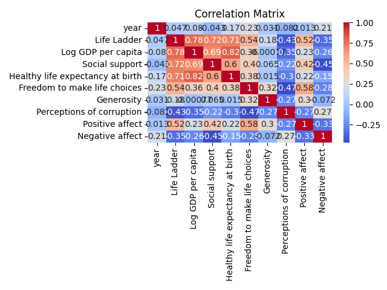

# Automated Analysis Report for happiness.csv

## Dataset Overview
Columns and Types:

Country name                         object
year                                float64
Life Ladder                         float64
Log GDP per capita                  float64
Social support                      float64
Healthy life expectancy at birth    float64
Freedom to make life choices        float64
Generosity                          float64
Perceptions of corruption           float64
Positive affect                     float64
Negative affect                     float64

### Summary Statistics
```
       Country name         year  Life Ladder  Log GDP per capita  Social support  Healthy life expectancy at birth  Freedom to make life choices   Generosity  Perceptions of corruption  Positive affect  Negative affect
count          2363  2363.000000  2363.000000         2363.000000     2363.000000                       2363.000000                   2363.000000  2363.000000                2363.000000      2363.000000      2363.000000
unique          165          NaN          NaN                 NaN             NaN                               NaN                           NaN          NaN                        NaN              NaN              NaN
top       Argentina          NaN          NaN                 NaN             NaN                               NaN                           NaN          NaN                        NaN              NaN              NaN
freq             18          NaN          NaN                 NaN             NaN                               NaN                           NaN          NaN                        NaN              NaN              NaN
mean            NaN  2014.763860     5.483566            9.399671        0.809369                         63.401828                      0.750282     0.000098                   0.743971         0.651882         0.273151
std             NaN     5.059436     1.125522            1.145221        0.120878                          6.750773                      0.138291     0.158596                   0.179907         0.105699         0.086835
min             NaN  2005.000000     1.281000            5.527000        0.228000                          6.720000                      0.228000    -0.340000                   0.035000         0.179000         0.083000
25%             NaN  2011.000000     4.647000            8.520000        0.744000                         59.545000                      0.662000    -0.108000                   0.696000         0.573000         0.209000
50%             NaN  2015.000000     5.449000            9.492000        0.834000                         64.900000                      0.769000    -0.015000                   0.790000         0.662000         0.263000
75%             NaN  2019.000000     6.323500           10.382000        0.904000                         68.400000                      0.861000     0.088000                   0.864000         0.736500         0.326000
max             NaN  2023.000000     8.019000           11.676000        0.987000                         74.600000                      0.985000     0.700000                   0.983000         0.884000         0.705000
```

### Missing Values
```
Country name                        0
year                                0
Life Ladder                         0
Log GDP per capita                  0
Social support                      0
Healthy life expectancy at birth    0
Freedom to make life choices        0
Generosity                          0
Perceptions of corruption           0
Positive affect                     0
Negative affect                     0
```

## Visualizations

### Correlation Matrix Insights:
{'id': 'chatcmpl-AdeMvLOYa6h1FnyG7AkbFVUDCC6Fg', 'object': 'chat.completion', 'created': 1734013333, 'model': 'gpt-4o-mini-2024-07-18', 'choices': [{'index': 0, 'message': {'role': 'assistant', 'content': "I'm unable to view images or files directly. However, I can help you analyze a correlation matrix if you describe its contents, such as the variables included, the correlation coefficients, and any notable patterns or highlights you observe. Here are some questions to guide your analysis:\n\n1. **Variables**: What variables are included in the correlation matrix? \n\n2. **Correlation Coefficients**: What are the correlation coefficients between the variables? Typically, values range from -1 to 1, where:\n   - 1 indicates a perfect positive correlation,\n   - -1 indicates a perfect negative correlation,\n   - 0 indicates no correlation.\n\n3. **Strongest Correlations**: Which variables have the strongest positive and negative correlations? What might these relationships indicate?\n\n4. **Trends and Patterns**: Are there any noticeable trends or patterns in the correlations? For example, do certain groups of variables tend to correlate with each other?\n\n5. **Implications**: Based on the correlations, what insights can be drawn regarding happiness? Are there specific factors that appear to significantly influence happiness levels?\n\nIf you provide this information, I can help you interpret the results and offer further insights!", 'refusal': None}, 'logprobs': None, 'finish_reason': 'stop'}], 'usage': {'prompt_tokens': 44, 'completion_tokens': 238, 'total_tokens': 282, 'prompt_tokens_details': {'cached_tokens': 0, 'audio_tokens': 0}, 'completion_tokens_details': {'reasoning_tokens': 0, 'audio_tokens': 0, 'accepted_prediction_tokens': 0, 'rejected_prediction_tokens': 0}}, 'system_fingerprint': 'fp_bba3c8e70b', 'monthlyCost': 0.11890200000000001, 'cost': 0.00156, 'monthlyRequests': 19}

