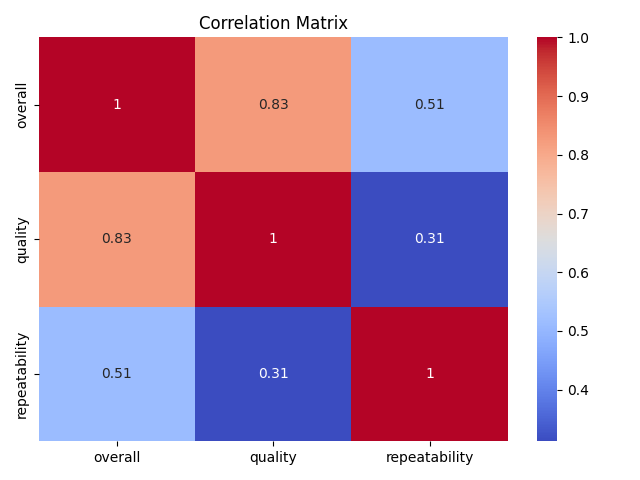
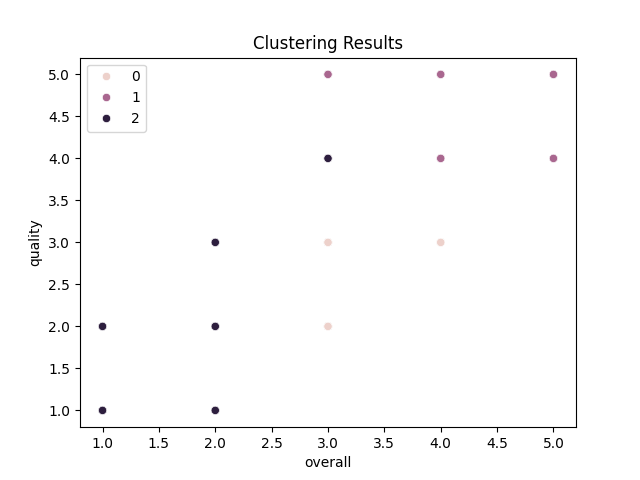

# Automated Analysis Report for media.csv
## Dataset Overview
Columns and Types:
date              object
language          object
type              object
title             object
by                object
overall          float64
quality          float64
repeatability    float64
Cluster            int32
dtype: object

Summary Statistics:
             date language   type              title                 by      overall      quality  repeatability
count        2553     2652   2652               2652               2390  2652.000000  2652.000000    2652.000000
unique       2055       11      8               2312               1528          NaN          NaN            NaN
top     21-May-06  English  movie  Kanda Naal Mudhal  Kiefer Sutherland          NaN          NaN            NaN
freq            8     1306   2211                  9                 48          NaN          NaN            NaN
mean          NaN      NaN    NaN                NaN                NaN     3.047511     3.209276       1.494721
std           NaN      NaN    NaN                NaN                NaN     0.762180     0.796743       0.598289
min           NaN      NaN    NaN                NaN                NaN     1.000000     1.000000       1.000000
25%           NaN      NaN    NaN                NaN                NaN     3.000000     3.000000       1.000000
50%           NaN      NaN    NaN                NaN                NaN     3.000000     3.000000       1.000000
75%           NaN      NaN    NaN                NaN                NaN     3.000000     4.000000       2.000000
max           NaN      NaN    NaN                NaN                NaN     5.000000     5.000000       3.000000

Missing Values:
date              99
language           0
type               0
title              0
by               262
overall            0
quality            0
repeatability      0

Outliers (Isolation Forest):
Detected 725 outliers

Clustering Results:
Cluster
2    1369
0     673
1     610

Regression Analysis Coefficients:
[0.06000901339306222, -0.06707580402552937, -1.0865488823772727]

LLM Insights:
{'id': 'chatcmpl-AdZBY9j88JkNO5Y3LWKuGwG3FVM0f', 'object': 'chat.completion', 'created': 1733993408, 'model': 'gpt-4o-mini-2024-07-18', 'choices': [{'index': 0, 'message': {'role': 'assistant', 'content': '```json\n{\n  "suggestions": {\n    "key_visualizations": [\n      {\n        "type": "line_chart",\n        "description": "Trend of overall ratings over time by language to observe patterns and changes."\n      },\n      {\n        "type": "bar_chart",\n        "description": "Count of entries by language to see which languages are most represented in the dataset."\n      },\n      {\n        "type": "heatmap",\n        "description": "Quality vs. repeatability scores to identify areas for improvement."\n      },\n      {\n        "type": "pie_chart",\n        "description": "Distribution of types (e.g., article, blog post) to understand the content composition."\n      },\n      {\n        "type": "scatter_plot",\n        "description": "Relationship between overall ratings and quality scores to analyze correlations."\n      },\n      {\n        "type": "box_plot",\n        "description": "Comparison of overall ratings across different clusters to assess consistency in ratings."\n      }\n    ],\n    "additional_insights": [\n      {\n        "insight": "Identify top languages by average overall rating to focus on high-performing languages."\n      },\n      {\n        "insight": "Analyze the distribution of types within each cluster to understand content strategy."\n      },\n      {\n        "insight": "Examine the variance in quality and repeatability scores to highlight areas needing attention."\n      },\n      {\n        "insight": "Explore temporal patterns in ratings to detect seasonal trends or effects of specific events."\n      },\n      {\n        "insight": "Investigate correlations between authors (\'by\') and overall ratings to identify star contributors."\n      }\n    ]\n  }\n}\n```', 'refusal': None}, 'logprobs': None, 'finish_reason': 'stop'}], 'usage': {'prompt_tokens': 71, 'completion_tokens': 342, 'total_tokens': 413, 'prompt_tokens_details': {'cached_tokens': 0, 'audio_tokens': 0}, 'completion_tokens_details': {'reasoning_tokens': 0, 'audio_tokens': 0, 'accepted_prediction_tokens': 0, 'rejected_prediction_tokens': 0}}, 'system_fingerprint': 'fp_bba3c8e70b', 'monthlyCost': 0.010638, 'cost': 0.002265, 'monthlyRequests': 3}

Regression Insights:
{'id': 'chatcmpl-AdZBeesbsSrrxHxjgJrX8nnBg2Ebs', 'object': 'chat.completion', 'created': 1733993414, 'model': 'gpt-4o-mini-2024-07-18', 'choices': [{'index': 0, 'message': {'role': 'assistant', 'content': "To provide insights and actionable recommendations based on the regression coefficients you've shared, we need to interpret what these coefficients represent. Let's assume the coefficients correspond to a linear regression model predicting a particular outcome based on three independent variables (features).\n\n### Interpretation of Coefficients:\n1. **Coefficient 1 (0.0600)**: This positive coefficient suggests that for every one-unit increase in the associated independent variable, the dependent variable (outcome) increases by approximately 0.0600 units, assuming all other variables remain constant. This indicates a positive relationship.\n\n2. **Coefficient 2 (-0.0671)**: This negative coefficient indicates that for every one-unit increase in this independent variable, the dependent variable decreases by approximately 0.0671 units, with all else held constant. This suggests an inverse relationship.\n\n3. **Coefficient 3 (-1.0865)**: This coefficient is notably larger in absolute value and negative, indicating that an increase in this independent variable has a substantial negative effect on the outcome. Specifically, for every one-unit increase in this variable, the dependent variable decreases by about 1.0865 units, highlighting a strong inverse relationship.\n\n### Insights:\n- The first variable positively influences the outcome, suggesting that efforts to increase this variable could lead to improved results.\n- The second variable has a minor negative impact; thus, it may be worth investigating its role in the model and determining if its increase can be mitigated or if its influence can be reduced.\n- The third variable has a significant negative impact on the outcome, indicating it might be a critical factor to address. This variable should be analyzed further to understand its implications and how it can be managed or modified.\n\n### Actionable Recommendations:\n1. **Enhance Positive Variable**: Focus on strategies that can increase the first independent variable. This could involve training, resource allocation, or improving processes that enhance this variable.\n\n2. **Mitigate Negative Impacts of the Second Variable**: Investigate the second variable further to understand its context and influence. If applicable, implement measures to reduce its negative impact. This could include providing support or resources that offset its adverse effects.\n\n3. **Address the Third Variable**: Given its strong negative influence, prioritize understanding and managing this variable. Consider interventions designed to reduce its negative impact, such as:\n   - Revising policies or practices that contribute to increases in this variable.\n   - Conducting targeted training or awareness campaigns to mitigate the effects associated with it.\n   - Collaborating with stakeholders to find innovative solutions that address the underlying issues linked to this variable.\n\n4. **Monitor and Evaluate**: Continuously monitor the impact of changes made to these variables on the outcome. Utilize feedback loops and performance metrics to assess effectiveness and make adjustments as necessary.\n\n5. **Conduct Further Analysis**: Consider conducting additional analyses, such as interaction effects or nonlinear relationships, to gain a deeper understanding of how these variables relate to the outcome and to each other.\n\nBy focusing on these areas, you can leverage the insights from the regression coefficients to drive improvements and achieve better outcomes in your analysis.", 'refusal': None}, 'logprobs': None, 'finish_reason': 'stop'}], 'usage': {'prompt_tokens': 59, 'completion_tokens': 622, 'total_tokens': 681, 'prompt_tokens_details': {'cached_tokens': 0, 'audio_tokens': 0}, 'completion_tokens_details': {'reasoning_tokens': 0, 'audio_tokens': 0, 'accepted_prediction_tokens': 0, 'rejected_prediction_tokens': 0}}, 'system_fingerprint': 'fp_bba3c8e70b', 'monthlyCost': 0.014547000000000001, 'cost': 0.003909, 'monthlyRequests': 4}

## Visualizations


