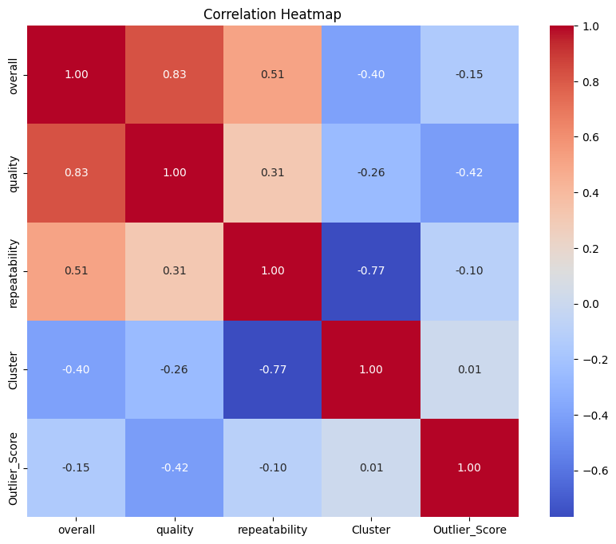

# Automated Analysis Report

Analysis for dataset: `media.csv`

## Dataset Overview
|        | date                          | language   | type   | title             | by                |    overall |     quality |   repeatability |
|:-------|:------------------------------|:-----------|:-------|:------------------|:------------------|-----------:|------------:|----------------:|
| count  | 2553                          | 2652       | 2652   | 2652              | 2390              | 2652       | 2652        |     2652        |
| unique | nan                           | 11         | 8      | 2312              | 1528              |  nan       |  nan        |      nan        |
| top    | nan                           | English    | movie  | Kanda Naal Mudhal | Kiefer Sutherland |  nan       |  nan        |      nan        |
| freq   | nan                           | 1306       | 2211   | 9                 | 48                |  nan       |  nan        |      nan        |
| mean   | 2013-12-16 21:25:27.144535808 | nan        | nan    | nan               | nan               |    3.04751 |    3.20928  |        1.49472  |
| min    | 2005-06-18 00:00:00           | nan        | nan    | nan               | nan               |    1       |    1        |        1        |
| 25%    | 2008-03-24 00:00:00           | nan        | nan    | nan               | nan               |    3       |    3        |        1        |
| 50%    | 2013-12-03 00:00:00           | nan        | nan    | nan               | nan               |    3       |    3        |        1        |
| 75%    | 2019-05-24 00:00:00           | nan        | nan    | nan               | nan               |    3       |    4        |        2        |
| max    | 2024-11-15 00:00:00           | nan        | nan    | nan               | nan               |    5       |    5        |        3        |
| std    | nan                           | nan        | nan    | nan               | nan               |    0.76218 |    0.796743 |        0.598289 |

## Correlation Matrix
|               |   overall |   quality |   repeatability |
|:--------------|----------:|----------:|----------------:|
| overall       |  1        |  0.825935 |        0.5126   |
| quality       |  0.825935 |  1        |        0.312127 |
| repeatability |  0.5126   |  0.312127 |        1        |

## Visualizations

